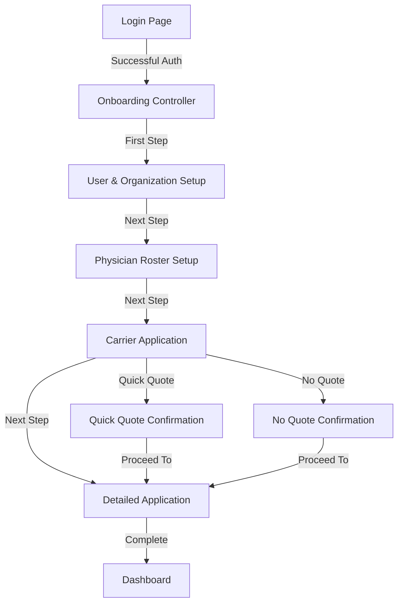
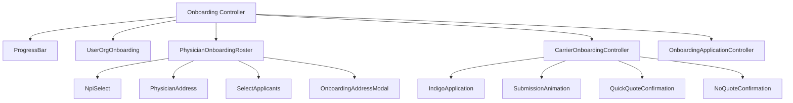
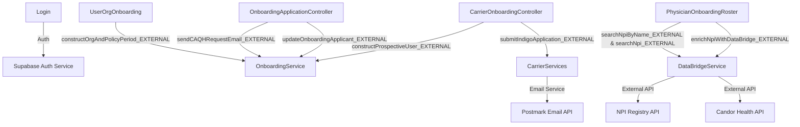
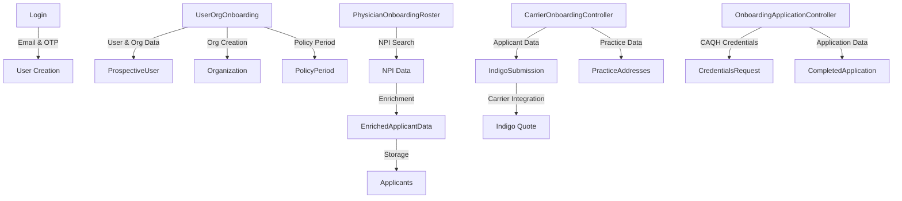
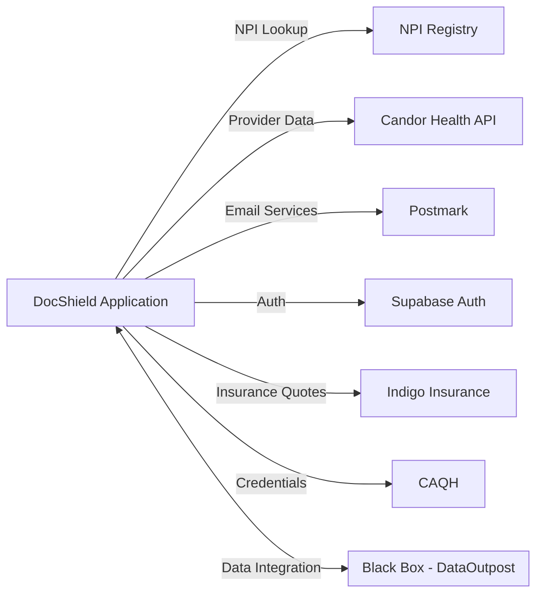

# DocShield Application Architecture Diagrams

## 1. User Flow Diagram

This diagram shows the user journey through the application:

## 2. UI Component Hierarchy

This diagram shows the component structure of the onboarding process:

## 3. Backend Services and API Connections

This diagram shows how UI components connect to backend services:

## 4. Data Flow Diagram

This diagram shows how data moves through the application:

## 5. External Systems Integration

## Summary of Application Structure

The DocShield application follows a multi-step onboarding flow where:

1. **Login/Registration**: Users enter through the login page using email and OTP authentication via Supabase.

2. **Onboarding Process** (sequential steps):
   - **User & Organization Setup**: Basic information collection
   - **Physician Roster Setup**: NPI lookup and data enrichment from external sources
   - **Carrier Application**: Insurance carrier integration (primarily Indigo)
   - **Detailed Application**: CAQH credentials and detailed information collection

3. **Backend Services**:
   - **DataBridgeService**: Acts as a bridge to external provider data sources
   - **OnboardingService**: Handles the core onboarding workflow and data persistence
   - **CarrierServices**: Manages insurance carrier integrations

4. **External Integrations**:
   - NPI Registry for provider lookups
   - Candor Health for data enrichment
   - Indigo for insurance quotes
   - Postmark for email communications
   - Supabase for authentication

The application is built with Next.js using the app router pattern, with server components for API functionality ("use server" directives) and client components for UI rendering ("use client" directives).
